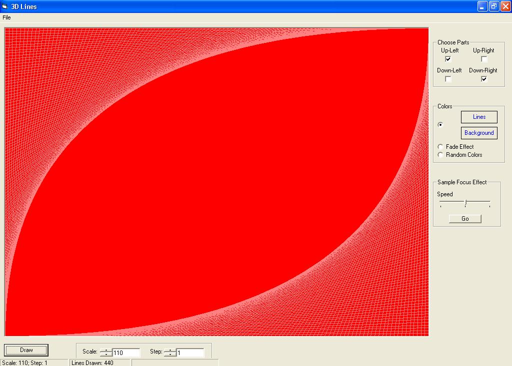



## Effect 3D Lines

### Description

This is an example of what you can do with only lines. It contains a focus/zoom effect also made with lines. Feedbacks are welcomed
 
### More Info
 

             |
---                |---
**Submitted On**   |2004-08-25 15:36:24
**By**             |[Licar Bogdan](https://github.com/Planet-Source-Code/PSCIndex/blob/master/ByAuthor/licar-bogdan.md)
**Level**          |Beginner
**User Rating**    |4.0 (8 globes from 2 users)
**Compatibility**  |VB 4\.0 \(16\-bit\), VB 5\.0, VB 6\.0, VB Script, ASP \(Active Server Pages\) , VBA MS Access, VBA MS Excel
**Category**       |[Math/ Dates](https://github.com/Planet-Source-Code/PSCIndex/blob/master/ByCategory/math-dates__1-37.md)
**World**          |[Visual Basic](https://github.com/Planet-Source-Code/PSCIndex/blob/master/ByWorld/visual-basic.md)
**Archive File**   |[Effect\_3D\_1785918252004\.zip](https://github.com/Planet-Source-Code/licar-bogdan-effect-3d-lines__1-55821/archive/master.zip)

